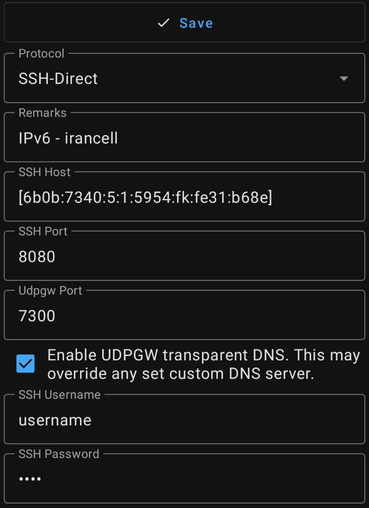

  
# About ShaHaN SSH Panel
همه چیز راجب پنل شاهان


# Telegram Channel: 

https://t.me/sixtininelearn


# Suggested OSs

- Ubuntu 20


# Block Iran IP Outgoing

````
bash <(curl -Ls https://raw.githubusercontent.com/HamedAp/Ssh-User-management/master/newblockiran.sh --ipv4)
````

# نحوه استفاده از ipv6  روی نپسترنت
<p align="center">
    <a href="https://youtu.be/emQSNXc1kpA">
        
        </img>
    </a>
</p>


✅ توضیحات فعال سازی و اتصال از طریق #ipv6 برای سیمکارت های ایرانسل

✅ اول از همه شما باید از سمت سرور خودتون اقدام کنید و IPv6 سرورتون رو رو پیدا کنید که عموما توی پنل کاربری اون سایتی که ازش خریدید موجوده، اگر پیدا نکردید میتونید دستور ifconfig /a رو توی ترمینال وارد کنید و پیداش کنید.
نمونه یک IPv6:
6b0b:7340:5:1:5954:fk:fe31:b68e

🛑 دقت کنید که اگر آخرش 64/ بود اونو پاک کنید و بجاش عدد 1 رو قرار بدید. ( خود / هم پاک کنید)

✅ مرحله بعد فعاسازی IPv6 برای سیمکارتتون هست که باید از طریق تنظیمات مراحل زیر رو طی کنید و APN پروتوکول رو روی IPv6/IPv4 قرار بدید:

Settings 》 Connections》Mobile Network 》Access Point Names》mtnirancell》APN Protocol 》IPv6/IPv4

✅ وارد برنامه NapsternetV بشید و یک کانفیگ اضافه کنید و طبق عکس بالا IPv6 خودتون روی توی [ ] قرار بدید و کانفیگ رو ذخیره کنید.

🛑 در صورتی که از برنامه http injector برای اتصال استفاده میکنید میتونید که IPv6 خودتون رو به دامنه کانکت کنید.


